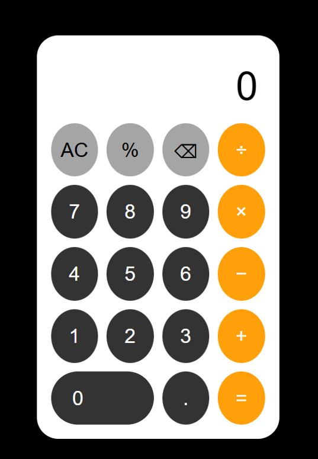

# CodeAlpha Calculator

A fully functional iPhone-style calculator built using HTML, CSS, and JavaScript.

## Features
- Addition, Subtraction, Multiplication, Division
- iPhone-style Calculator UI
- Responsive Design
- AC and Delete Buttons
- Fully Functional Calculator

## Technologies Used
- HTML
- CSS
- JavaScript

## Project Screenshot

## Developed By
Ansa Shabbir
